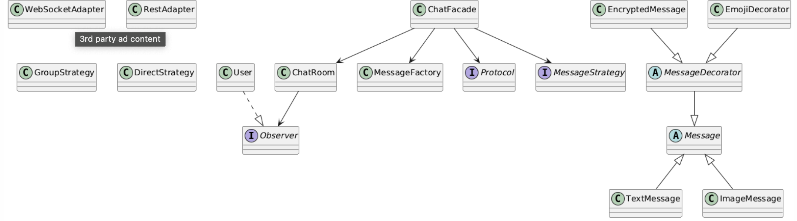

# **Chat Messaging Application – Final Project (Design Patterns)**

## *Software Design Patterns Course – Final Assignment*

---

##  **Overview**

This project is a fully functional **Chat Messaging Application** implemented in Java.
Its main purpose is to **demonstrate the integration of six different design patterns** inside a single cohesive system.

The architecture follows the principles of:

* **OOP Best Practices**
* **Clean Code**
* **SOLID**
* **High Cohesion & Low Coupling**

Inspirations include
*“Clean Code” — Robert C. Martin* and
*“Head First Design Patterns” — Eric Freeman*.

---

##  **Team Members and Responsibility**

| Student           | Implemented Patterns    |
| ----------------- | ----------------------- |
| **Erkebulan Zh.** | Observer, Decorator     |
| **Nurtilek K.**   | Factory Method, Adapter |
| **Nurdaulet A.**  | Strategy, Facade        |

Each team member implemented *at least two* patterns, matching the project requirements.

---

## 🎯 **Project Goals**

* Integrate **6 distinct design patterns** into one working program.
* Build a **clean, maintainable, scalable** system.
* Demonstrate real cooperation between multiple patterns.
* Provide a clear **API-like interface** via Facade.
* Produce a complete academic-style final project with UML diagrams, code, and screenshots.

---

##  **Implemented Design Patterns**

| Pattern            | Purpose                                              | Classes                              |
| ------------------ | ---------------------------------------------------- | ------------------------------------ |
| **Observer**       | Notify users when new messages appear                | `ChatRoom`, `User`                   |
| **Decorator**      | Dynamically add message features (encryption, emoji) | `EncryptedMessage`, `EmojiDecorator` |
| **Factory Method** | Create message objects (text, image)                 | `MessageFactory`                     |
| **Adapter**        | Switch between network protocols                     | `WebSocketAdapter`, `RestAdapter`    |
| **Strategy**       | Choose delivery type (group or direct)               | `GroupStrategy`, `DirectStrategy`    |
| **Facade**         | Provide single interface for whole system            | `ChatFacade`                         |

All six patterns work together in a coordinated system as required.

---

## ️ **How the System Works**

###  1. **ChatFacade** (Main Entry Point)

Controls:

* message creation
* application of decorators
* protocol selection
* strategy selection
* sending and saving messages

###  2. **Factory Method**

`MessageFactory` creates:

* `TextMessage`
* `ImageMessage`

###  3. **Decorator Pattern**

Used to enhance messages:

* `EncryptedMessage` — reverses text to simulate encryption
* `EmojiDecorator` — adds emoji to image messages

###  4. **Strategy Pattern**

Defines **how** messages are delivered:

* `GroupStrategy` → sends to all
* `DirectStrategy` → sends to one target

###  5. **Adapter Pattern**

Abstracts network protocol:

* `WebSocketAdapter`
* `RestAdapter`

###  6. **Observer Pattern**

Every `User` is an **Observer**, and `ChatRoom` notifies them when messages arrive.

---

##  **Example Program Output**
````
=== Demo 1: Group text message via WebSocket ===
Send operation completed:

[WebSocket] send: Text from System: Hello everyone!

Group message sent to all users: Text from System: Hello everyone!
--- User Messages ---
[Anna] received: Text from System: Hello everyone!
[Ivan] received: Text from System: Hello everyone!

=== Demo 2: Direct encrypted message ===
Send operation completed:

[WebSocket] send: [ENCRYPTED] navI ot terceS :metsyS morf txeT

Direct message sent to Ivan: [ENCRYPTED] navI ot terceS :metsyS morf txeT
--- User Messages ---
[Anna] received: Text from System: Hello everyone!
[Ivan] received: [ENCRYPTED] navI ot terceS :metsyS morf txeT

=== Demo 3: Image with emoji decorator via REST ===
Send operation completed:

[REST] POST: [Emoji] Image from System: [photo1.jpg] [Decorated]

Direct message sent to all (no target): [Emoji] Image from System: [photo1.jpg] [Decorated]
--- User Messages ---
[Anna] received: [Emoji] Image from System: [photo1.jpg] [Decorated]
[Ivan] received: [Emoji] Image from System: [photo1.jpg] [Decorated]

=== Statistics ===
Total messages: 3
Last operation: Message sent successfully: [Emoji] Image from System: [photo1.jpg] [Decorated]

Process finished with exit code 0
````

✔ This confirms that **all six patterns function together correctly**.

---

## 📁 **Project Structure**
````
chat-messaging-app/
│
├── src/main/java/com/chatapp/
│ ├── Main.java
│ ├── facade/ChatFacade.java
│ ├── factory/MessageFactory.java
│ ├── observer/
│ │ ├── ChatRoom.java
│ │ ├── User.java
│ │ └── Observer.java
│ ├── decorator/
│ │ ├── MessageDecorator.java
│ │ ├── EncryptedMessage.java
│ │ └── EmojiDecorator.java
│ ├── strategy/
│ │ ├── GroupStrategy.java
│ │ ├── DirectStrategy.java
│ │ └── MessageStrategy.java
│ ├── adapter/
│ │ ├── Protocol.java
│ │ ├── WebSocketAdapter.java
│ │ └── RestAdapter.java
│ └── model/
│ ├── Message.java
│ ├── TextMessage.java
│ └── ImageMessage.java
````
## 📐 **UML Diagram (PlantUML)**

````
@startuml
interface Observer
class User
class ChatRoom
abstract class Message
class TextMessage
class ImageMessage
class MessageFactory
abstract class MessageDecorator
class EncryptedMessage
class EmojiDecorator
interface Protocol
class WebSocketAdapter
class RestAdapter
interface MessageStrategy
class GroupStrategy
class DirectStrategy
class ChatFacade

Message <|-- TextMessage
Message <|-- ImageMessage

MessageDecorator --|> Message
EncryptedMessage --|> MessageDecorator
EmojiDecorator --|> MessageDecorator

User ..|> Observer
ChatRoom --> Observer

ChatFacade --> MessageFactory
ChatFacade --> Protocol
ChatFacade --> MessageStrategy
ChatFacade --> ChatRoom
@enduml
````

---

## ▶ **How to Run**

### 1. Ensure JDK 17+ is installed

### 2. Build project:
- mvn clean compile

### 3. Run application:
- mvn exec:java -Dexec.mainClass=com.chatapp.Main

---

##  **Conclusion**

This Chat Messaging Application successfully demonstrates:

* Coordination of **six design patterns**
* Clean and extensible architecture
* Proper team collaboration
* Working, testable, maintainable code

The project meets *all* requirements of the final assignment.

---

##  **Future Improvements**

* Add a JavaFX GUI
* Store message history in a database
* Implement user authentication
* Add JUnit tests
* Encrypt messages using AES instead of reverse-string

---

## 📚 **References**

* Robert C. Martin — *Clean Code*
* Eric Freeman — *Head First Design Patterns*
* Refactoring.Guru


